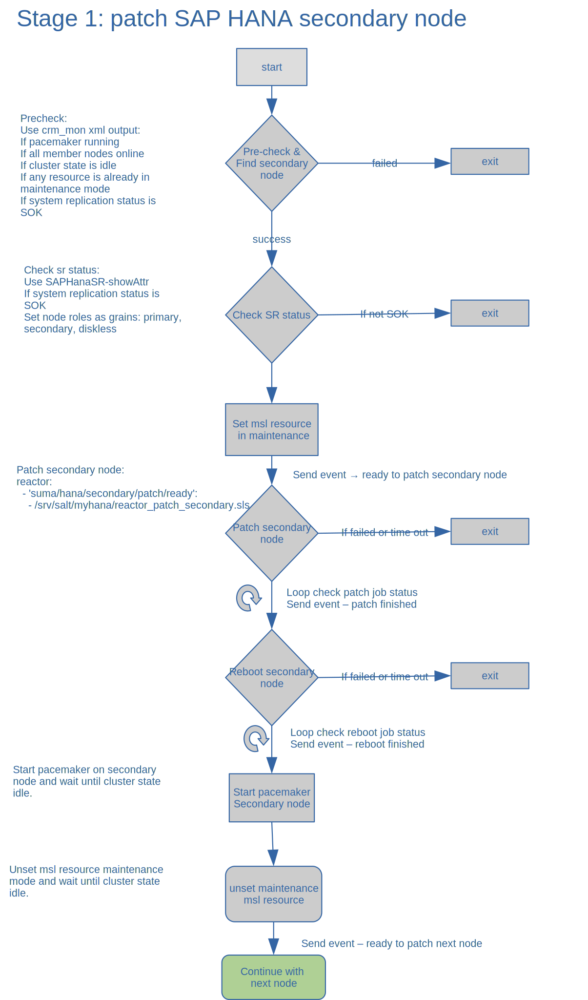
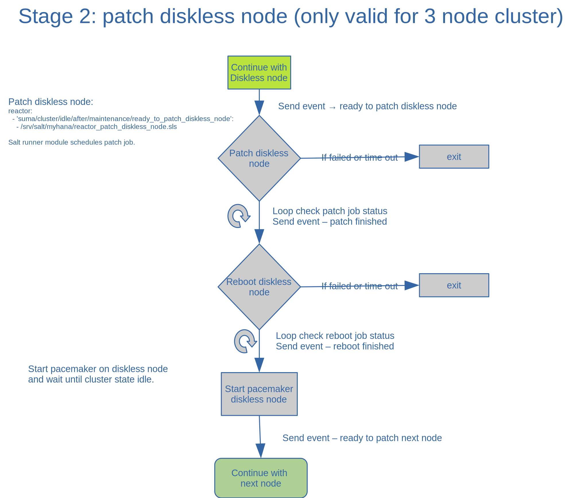
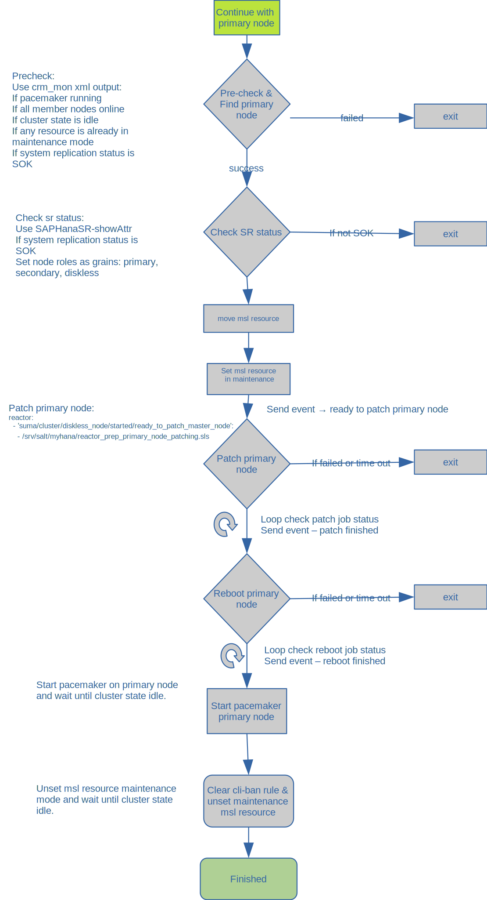

# Patching SAP HANA System Replication - Secondary node

## __The high level workflow:__

## Stage 1: patch secondary node:

#
# 
## Stage 2: patch diskless node (optional for 3 node cluster only):

#
#
## Stage 3: patch current primary node:

